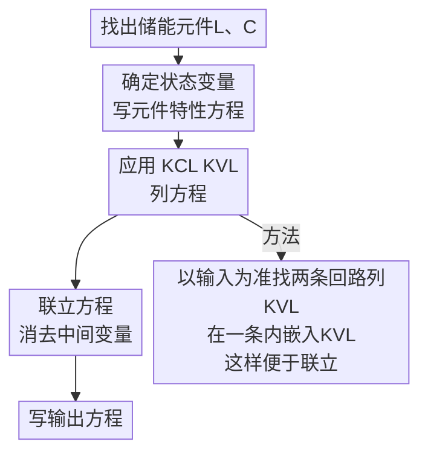

## 1. 微分方程建立

### RLC网络
🎯 核心原则：选对变量，事半功倍
> RLC串联电路：选电容电压 $u_C$ 为变量。 
> 原理：串联电流相等，可自然统一所有元件电压。

$$
i = C \frac{du_C}{dt} \tag{1-1}
$$

> RLC并联电路：选电感电流 $i_L$ 为变量。 
> 原理：并联电压相等，可自然统一所有元件电流。
 
$$
u = L \frac{di_L}{dt} \tag{1-2}
$$

🚀 技巧一：背标准模板（应对标准电路）

$$LCu_C'' + RCu_C' + u_C = U_s(t) \tag{1-3}$$

$$LCi_L'' + \frac{L}{R}i_L' + iL = I_s(t) \tag{1-4}$$

💣 技巧二：算子法（应对复杂电路降维打击）

$$p = \frac{d}{dt} \tag{1-5}$$

> 纯电阻列方程：当作直流电路，用节点电压法或网孔电流法列方程。

🤏 实战：下面这个RLC混联电路可以列如下方程

$$
\left\{
\begin{aligned}
u_i &= L\frac{di_L}{dt}
      + u_c
      + R_3C\frac{du_c}{dt}, &&&& (1-6) \\[6pt]

u_i &= L\frac{di_L}{dt}
      + R_2\left(
      i_L
      - C\frac{du_c}{dt}
      + \frac{L}{R_1}\frac{di_L}{dt}
      \right), &&&& (1-7) \\[6pt]

u_o &= R_3C\frac{du_c}{dt}. &&&& (1-8)
\end{aligned}
\right.
$$

💡想法
> 对于这种混联的问题,可以以下流程解题 
> 微分方程的建立是后面传递函数与状态空间的基础

---

### 力学系统

---

### MSB系统

---

### 机械转动系统

---

### 拖动系统

---

## 2. 传递函数

### 拉式变换

---

### 性质

---

### 常用拉式变换

---

### 基本概念

---

### 方框图化简

---

### 梅森公式

---

## 3. 频率特性

### 频率响应

---

### 三种图示法

---

## 4. 状态空间

### 基本概念

---

### 如何建立状态空间表达式

---

### 三种标准型的使用场景

---

### 传递函数与状态空间的相互转换

---

## 5. 分析与综合

### 稳定性分析

---

### 能控性与能观性的工程意义

---

### 控制器设计

---

